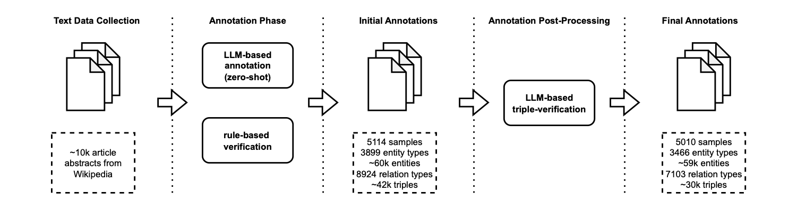
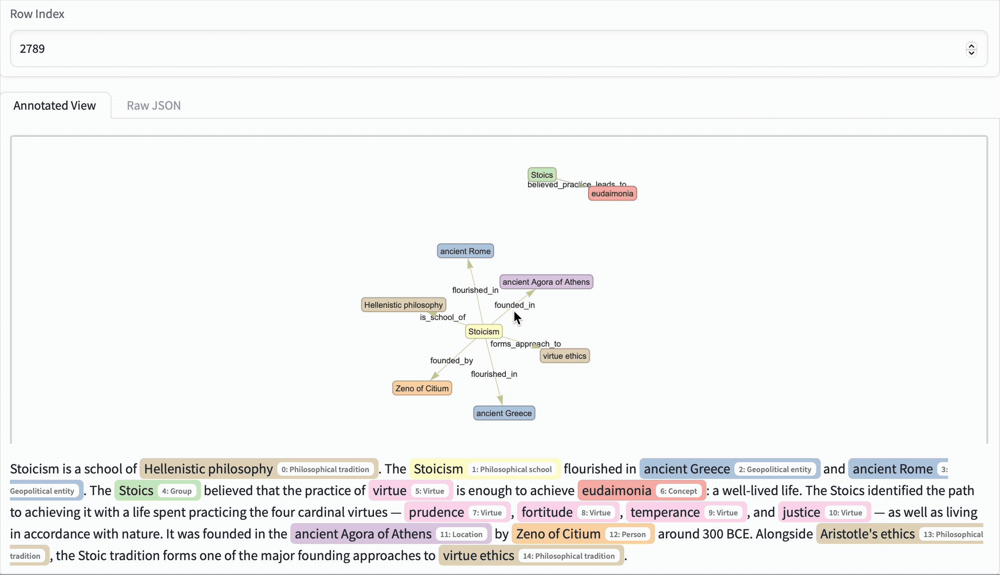

# DocIE@XLLM25: In-Context Learning for Information Extraction using Fully Synthetic Demonstrations



## Resources
- [Link to paper](https://aclanthology.org/2025.xllm-1.26/)
- [Link to dataset](https://huggingface.co/datasets/nicpopovic/vital_articles_synthetic_information_extraction)
- [Link to shared task](https://xllms.github.io/DocIE/)
- [Link to dataset explorer (shown below)](https://huggingface.co/spaces/nicpopovic/vital_articles_synth_explorer)
- [Link to overview including video presentation](https://nicpopovic.com/publications/docie)



## Citation
If you use this code or dataset in your research, please cite our paper:
```bibtex
@inproceedings{popovic-etal-2025-docie,
    title = "{D}oc{IE}@{XLLM}25: In-Context Learning for Information Extraction using Fully Synthetic Demonstrations",
    author = {Popovic, Nicholas  and
      Kangen, Ashish  and
      Schopf, Tim  and
      F{\"a}rber, Michael},
    booktitle = "Proceedings of the 1st Joint Workshop on Large Language Models and Structure Modeling (XLLM 2025)",
    month = aug,
    year = "2025",
    url = "https://aclanthology.org/2025.xllm-1.26/",
}
```
